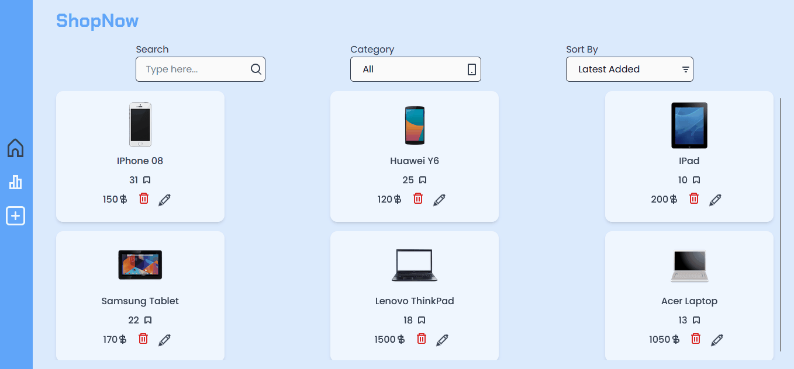
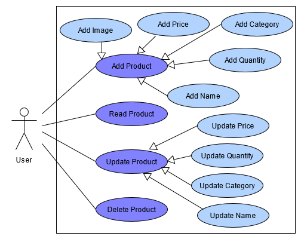
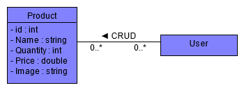
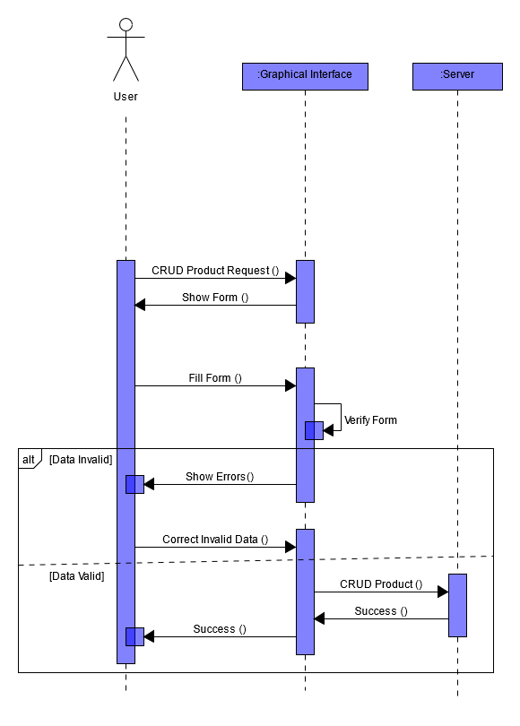

# Inventory Management Application

Conception and Development of an Application to manage the inventory of a store.

## Demo

## Conception

UML Diagrams :

- Use Case Diagram :

- Class Diagram :

- Sequence Diagram :

## Mockups & Prototyping

You can preview the Figma file [HERE](https://www.figma.com/proto/NfmPUC703aA0HZ1cXbMI2F/ShopNow?node-id=202%3A736&scaling=contain&page-id=0%3A1&starting-point-node-id=159%3A839&show-proto-sidebar=1)
